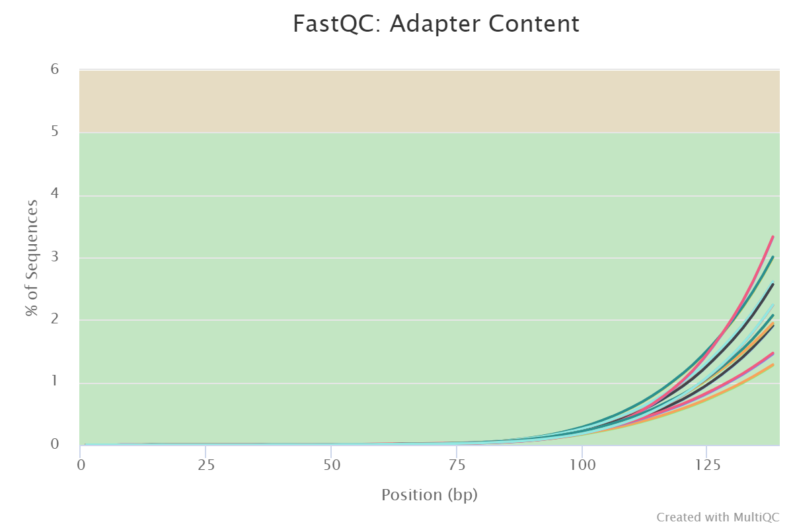
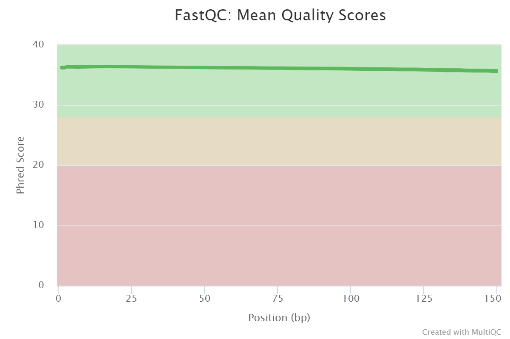

# Produced Water - Oilfield : RNA Seq Analysis of *Phaeodactylum tricornutum*

For:\
SJSU CS 286

By:
\
Codey Phoun
\
Claudia Vo
\
Sudhin Domala

https://github.com/codey-phoun/pw_oilfield

&nbsp;

## Project Introduction

Produced water (PW) is water produced as a byproduct during the extraction of oil and natural gases. The water quality of PW ranges from well to well, but most PW contains oils, heavy metals, and traces of naturally occurring radioactive material. PW can serve as an alternative water source if the pollutants found in the water are removed. For now, PW can be used in algae cultivation for biofuel production. In this study, we aim to examine the exponential growth and physiology of the diatom *Phaeodactylum tricornutum* under three types of conditions: no treatment (control), 10% PW, and 100% PW. Also, we will examine the stationary growth phase under no treatment and high treatment PW.

[Oil and gas produced water as a growth medium for microalgae cultivation: A review and feasibility analysis - Graham 2017](https://www.osti.gov/pages/servlets/purl/1344355)

## Project Setup

### Connect to the CoS HPC

You must first be connected to the SJSU VPN.
See <https://www.sjsu.edu/it/services/network/vpn/index.php>

```bash
ssh cphoun@spartan01.sjsu.edu
```

### Conda Environment

```bash
conda activate RNAseq_v2.0
```

### Working Directory and File Structure on CoS HPC

```bash
~/pw_oilfield/assembly
~/pw_oilfield/annotation
~/pw_oilfield/data
~/pw_oilfield/fastqc
~/pw_oilfield/scripts
~/pw_oilfield/trimmed
```

### Transferring to and from CoS HPC with rsync - Examples

From local to HPC

```bash
rsync -azhP *.sh cphoun@spartan01.sjsu.edu:/home/cphoun/pw_oilfield/scripts/
```

From HPC to local

```bash
rsync -azhP cphoun@spartan01.sjsu.edu:/home/cphoun/pw_oilfield/fastqc/ ./fastqc/
```

### Submitting Jobs to CoS HPC - Example

```bash
sbatch job.sh # submit a job
squeue # check status of a job
```

See <http://spartan01.sjsu.edu/dokuwiki/doku.php?id=hpc:intro:job-submission> for more details.


&nbsp;

## Data Files

|Sample Name example|Short Sample Description|Sample description          |
|-------------------|------------------------|----------------------------|
|HQ_ST1             |Normal Medium Stationary|Harvested in the stationary phase from cultures grown in normal medium (control)|
|PW_ST1             |100% PW Stationary      |Harvested in the stationary phase from cultures grown in pure oil-field produced water (treatment)|
|HQE1               |Normal Exponential      |Harvested in the exponential phase from cultures grown in normal medium (control)|
|HQ10E1             |Normal + 10% PW Exponential |Harvested in the Exponential phase from cultures grown in normal medium to which 10% oil-field produced water was added (intermediate level of treatment)|
|PWE1               |100% PW Exponential     |Harvested in the Exponential phase from cultures grown in pure oil-field produced water (high level of treatment)|

&nbsp;

file          |num_seqs|sum_len   |min_len|avg_len|max_len|
:-------------|:-------|:---------|:------|:------|:------|
HQ10E1_1.fq.gz|23551403|3532710450|150    |150.0  |150
HQ10E1_2.fq.gz|23551403|3532710450|150    |150.0  |150
HQ10E2_1.fq.gz|26688235|4003235250|150    |150.0  |150
HQ10E2_2.fq.gz|26688235|4003235250|150    |150.0  |150
HQE1_1.fq.gz  |26535998|3980399700|150    |150.0  |150
HQE1_2.fq.gz  |26535998|3980399700|150    |150.0  |150
HQE2_1.fq.gz  |19332203|2899830450|150    |150.0  |150
HQE2_2.fq.gz  |19332203|2899830450|150    |150.0  |150
HQ_ST1_1.fq.gz|18270958|2740643700|150    |150.0  |150
HQ_ST1_2.fq.gz|18270958|2740643700|150    |150.0  |150
HQ_ST2_1.fq.gz|22481656|3372248400|150    |150.0  |150
HQ_ST2_2.fq.gz|22481656|3372248400|150    |150.0  |150
PWE1_1.fq.gz  |22364529|3354679350|150    |150.0  |150
PWE1_2.fq.gz  |22364529|3354679350|150    |150.0  |150
PWE2_1.fq.gz  |22976366|3446454900|150    |150.0  |150
PWE2_2.fq.gz  |22976366|3446454900|150    |150.0  |150
PW_ST1_1.fq.gz|21253694|3188054100|150    |150.0  |150
PW_ST1_2.fq.gz|21253694|3188054100|150    |150.0  |150
PW_ST2_1.fq.gz|26092202|3913830300|150    |150.0  |150
PW_ST2_2.fq.gz|26092202|3913830300|150    |150.0  |150

&nbsp;

RNA integrity number (RIN) of samples HQ_ST2 and PW_ST2 was between 4.6-5.8. Moderate degradation observed.

&nbsp;

## *Phaeodactylum tricornutum* Files

Phaeodactylum tricornutum files can be accessed through Ensembl ftp

```bash
ftp
open ftp.ensemblgenomes.org
```

### Downloading assembly files

<https://protists.ensembl.org/Phaeodactylum_tricornutum/Info/Index/>

```bash
wget ftp://ftp.ensemblgenomes.org/pub/protists/release-50/fasta/phaeodactylum_tricornutum/dna/Phaeodactylum_tricornutum.ASM15095v2.dna.toplevel.fa.gz
```

### Downloading annotation files

```bash
wget ftp://ftp.ensemblgenomes.org/pub/protists/release-50/gff3/phaeodactylum_tricornutum/Phaeodactylum_tricornutum.ASM15095v2.50.gff3.gz
wget ftp://ftp.ensemblgenomes.org/pub/release-50/protists/gtf/phaeodactylum_tricornutum/Phaeodactylum_tricornutum.ASM15095v2.50.gtf.gz
```

&nbsp;

## Checking quality of data files with FastQC

Run each data file through FastQC and consolidate reports with MultiQC

```bash
fastqc ~/pw_oilfield/data/* \
--threads 56 \
--outdir ~/pw_oilfield/fastqc

multiqc ~/pw_oilfield/fastqc \
--filename fastqc_multiqc.html \
--outdir ~/pw_oilfield/fastqc/multiqc
```

Illumina Universal Adapters are present at the ends of the reads.


Overall quality scores are high and consistent across the reads.


HQ10E2_2 shows presence of poly-T tail in reads


&nbsp;

## Adapter Trimming with Cutadapt

### Cutadapt script

```bash
for sample in HQ_ST1 HQ_ST2 PW_ST1 PW_ST2 HQE1 HQE2 HQ10E1 HQ10E2 PWE1 PWE2

do
    echo "Processing $sample"

    cutadapt \
    -a AGATCGGAAGAGCACACGTCTGAACTCCAGTCA `# TruSeq single index Read 1` \
    -A AGATCGGAAGAGCGTCGTGTAGGGAAAGAGTGT `# # TruSeq single index Read 2` \
    --cores 0 `# auto-detect number of CPU cores to use` \
    --overlap 10 `# minimum length overlap between read and adapter` \
    --quality-cutoff 20,20 `# trim low-quality bases from 5' and 3' ends before adapter removal` \
    --minimum-length 50 `# minimum read length after trimming` \
    -o ~/pw_oilfield/trimmed/${sample}_1_trimmed.fq.gz `# Read 1 output` \
    -p ~/pw_oilfield/trimmed/${sample}_2_trimmed.fq.gz `# Read 2 output` \
    ~/pw_oilfield/data/${sample}_1.fq.gz `# Read 1 input` \
    ~/pw_oilfield/data/${sample}_2.fq.gz `# Read 2 input` \
    > ~/pw_oilfield/trimmed/${sample}_trim_log.txt

done
```

### Cutadapt Results

|  Sample  | pairs_processed | r1_with_adapters | r2_with_adapters | pairs_too_short | pairs_written | bp_processed | quality_trimmed | bp_written |
|:--------:|:---------------:|:----------------:|:----------------:|:---------------:|:-------------:|:------------:|:---------------:|:----------:|
| HQ10E1_2 |     23551403    |      542058      |      540914      |      21374      |    23530029   |  7065420900  |     7096090     | 7026739438 |
| HQ10E2_2 |     26688235    |      399295      |      399884      |      22288      |    26665947   |  8006470500  |     9661715     | 7970253086 |
|  HQE1_2  |     26535998    |      453925      |      455116      |      23560      |    26512438   |  7960799400  |     8824952     | 7922420846 |
|  HQE2_2  |     19332203    |      703448      |      700253      |      17660      |    19314543   |  5799660900  |     6389443     | 5754219764 |
| HQ_ST1_2 |     18270958    |      575768      |      573495      |      19446      |    18251512   |  5481287400  |     7117969     | 5441467786 |
| HQ_ST2_2 |     22481656    |      699219      |      696639      |      23800      |    22457856   |  6744496800  |     8536049     | 6696879626 |
|  PWE1_2  |     22364529    |      516687      |      516029      |      24157      |    22340372   |  6709358700  |     8904517     | 6668569658 |
|  PWE2_2  |     22976366    |      945548      |      942695      |      31648      |    22944718   |  6892909800  |     9762339     | 6834065958 |
| PW_ST1_2 |     21253694    |      529637      |      527825      |      24462      |    21229232   |  6376108200  |     8041844     | 6336399004 |
| PW_ST2_2 |     26092202    |      710715      |      709480      |      24598      |    26067604   |  7827660600  |     8576226     | 7779612587 |
&nbsp;

|  Sample  | percent_trimmed |
|:--------:|:---------------:|
| HQ10E1_2 |      0.547      |
| HQ10E2_2 |      0.452      |
|  HQE1_2  |      0.482      |
|  HQE2_2  |      0.784      |
| HQ_ST1_2 |      0.726      |
| HQ_ST2_2 |      0.706      |
|  PWE1_2  |      0.608      |
|  PWE2_2  |      0.854      |
| PW_ST1_2 |      0.623      |
| PW_ST2_2 |      0.614      |

\
Poly-T tails are also no longer present in HQ10E2_2.

&nbsp;

## Indexing Reference Genome and Annotation

Index the genome with STAR

```bash
STAR \
--runThreadN 56 \
--runMode genomeGenerate \
--genomeDir ~/pw_oilfield/assembly \
--genomeFastaFiles ~/pw_oilfield/assembly/Phaeodactylum_tricornutum.ASM15095v2.dna.toplevel.fa \
--sjdbGTFfile ~/pw_oilfield/annotation/Phaeodactylum_tricornutum.ASM15095v2.50.gtf \
--sjdbOverhang 149 \
--genomeSAindexNbases 11
```

## Align Reads to Reference Genome with STAR

Map the sample reads to the reference genome with STAR.
Run the script run_star_align_parallel.sh

```bash
for sample in $(cd ~/pw_oilfield/trimmed && ls *.fq | sed s/_[12]_trimmed.fq// | sort -u)
do

sbatch ~/pw_oilfield/scripts/star_align_parallel.sh ${sample}
echo "Submitted ${sample}"

done
```

run_star_align_parallel.sh submits a STAR job in SLURM for each sample.

```bash
STAR \
--runThreadN 12 \
--runMode alignReads \
--genomeDir ~/pw_oilfield/assembly \
--quantMode GeneCounts \
--outSAMtype BAM SortedByCoordinate \
--limitBAMsortRAM 32000000000 `#32GB - can be increased if needed`\
--readFilesIn ~/pw_oilfield/trimmed/${sample}_1_trimmed.fq ~/pw_oilfield/trimmed/${sample}_2_trimmed.fq \
--outFileNamePrefix ~/pw_oilfield/alignment_sorted/${sample}_
```

## Create Count Table from STAR Alignment Results

The merge_star.sh script creates a matrix of the gene counts for each sample.

```bash
# modified from https://ucdavis-bioinformatics-training.github.io/2020-mRNA_Seq_Workshop/data_reduction/03-counts_mm

# create header file
echo gene_name $(cd ~/pw_oilfield/alignment_sorted && ls *_ReadsPerGene.out.tab | sed s/_ReadsPerGene.out.tab// | sort -u) > ~/pw_oilfield/alignment_sorted/tmp/header.txt

# Place each sample's STAR gene count file - ReadsPerGene.out.tab in the tmp/ directory 
# The 2nd column (-f2) of ReadsPerGene.out.tab contains the non-stranded counts
for sample in $(cd ~/pw_oilfield/alignment_sorted && ls *_ReadsPerGene.out.tab | sed s/_ReadsPerGene.out.tab// | sort -u)
do 
    echo ${sample}
    cat ~/pw_oilfield/alignment_sorted/${sample}_ReadsPerGene.out.tab | tail -n +5 | cut -f2 > ~/pw_oilfield/alignment_sorted/tmp/${sample}.count
done

# get a list of gene ids (-f1)
tail -n +5 ~/pw_oilfield/alignment_sorted/HQ10E1_ReadsPerGene.out.tab | cut -f1 > ~/pw_oilfield/alignment_sorted/tmp/geneids.txt

# combine all the columns of the count files
paste ~/pw_oilfield/alignment_sorted/tmp/geneids.txt ~/pw_oilfield/alignment_sorted/tmp/*.count > ~/pw_oilfield/alignment_sorted/tmp/tmp.out

# add the header
cat <(cat ~/pw_oilfield/alignment_sorted/tmp/header.txt | sed 's/ /\t/g') ~/pw_oilfield/alignment_sorted/tmp/tmp.out > ~/pw_oilfield/alignment_sorted/STAR_counts.txt

# remove the tmp folder
rm -rf ~/pw_oilfield/alignment_sorted/tmp
```

TO DO:

- View/Summarize STAR results with MultiQC
- Perform differential gene expression analysis in R
- Perform gene ontology enrichment analysis
